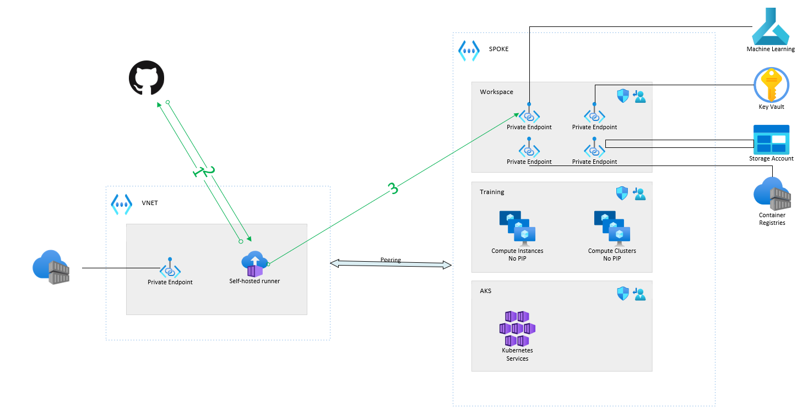
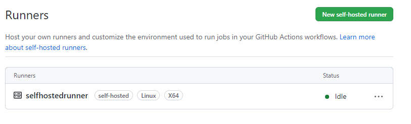

# aml-secure-pipeline

Example on how to trigger a AML pipeline from a Github pipeline, but with the specifics to allow it to run on a secure AML workspace.

We will use an Azure Container Instance to host the runner.

## Note 

### Public vs Private Github Pipeline

There is **one unique** difference between a public and a secure pipeline from a code perspective : you edit the github pipeline and set "self-hosted" instead of "ubuntu-latest" as the value of "runs-on:".

Aside that, you obviously need to set up your self-hosted runner in Azure and register it to GitHub.

### Hosted runners

For Github to be able to reach out to a private VNET that contains your AML workspace, you need to set up a [self-hosted runner](https://docs.github.com/en/actions/hosting-your-own-runners/about-self-hosted-runners) into the VNET, or a VNET peered to it.
There are multiple ways to implement a Github runner : 
- You can set up a VM in Azure
- you can set up a container in Azure, either in Azure Container Instance or in AKS

From a [network perspective](https://docs.github.com/en/actions/hosting-your-own-runners/about-self-hosted-runners#communication-between-self-hosted-runners-and-github), the runner will initiate the connection to Github, there is no inbound traffic to open. Outbound traffic to github is HTTPS.

To build the docker image, you can either :
- Use internal build function within a public Azure Container registry
- Use dedicated agent pool (preview) within a private ACR
- Build the container as part of a GH pipeline on a GH runner and push it to a public ACR

In this example I will build the image on a Github pipeline.
I choose to use the runner token as github secrets but you may find some interesting other example such as : 
https://github.com/charlenemckeown/github-runner-aci : using a PAT to token to access the token runner API

### Authentication

There are multiple ways for Github runner to authenticate so that it can run actions in Azure : 
- [Create a service principal](https://learn.microsoft.com/en-us/azure/developer/github/connect-from-azure?tabs=azure-portal%2Cwindows#use-the-azure-login-action-with-a-service-principal-secret) and provide the credentials as part of Github secret, it is the easiest way,but as a secret is used, it implies key rotation which is not ideal.
- Create a service principal with a certificated stored in a runner is a solution but certificates do expire, so let's avoid it.
- We can also [use a managed identity](https://www.cloudwithchris.com/blog/github-selfhosted-runner-on-azure/) that is tied to the runner as long as the runner is a Azure resource that's support it (VM & ACI do)
- Use an App registration with [federated crendentials](https://learn.microsoft.com/en-us/azure/developer/github/connect-from-azure?tabs=azure-portal%2Cwindows#use-the-azure-login-action-with-openid-connect). This is fairly new and the benefit is we don't have to store any credentials. This is what we are going to use here.

Managed identity is quite nice but to my opinion App registration with federated credentials is a bit more secure as it set up an additionnal security to tie the runner to a specific Github repository. 
For this reason, this code example will use App registration with federated credentials.

### Diagram

1. The self-hosted runner opens a HTTPS channel to Github.
1. A Github pipeline targetting the self hosted runner is triggered.
1. The self-hosted runner runs the pipeline locally and cli commands can access the secure AML workspace.

## Step By Step

This example assume you already set up the following prerequisites :
1. A secure AML workspace running in Azure
1. A compute cluster available called "cpu-cluster" (or change the pipeline.yml to match the name of your cluster)
1. A public azure Container registry

Next steps are to build and run the self hosted runner in a Azure Container Instance: 
1. [Create an app registration within Azure AD with OpenID Connect](https://learn.microsoft.com/en-us/azure/developer/github/connect-from-azure?tabs=azure-portal%2Cwindows#use-the-azure-login-action-with-openid-connect)
1. On the resource group the ACI is going to be, provide RBAC contributor permission to the app registration
1. Define the following secrets in Github that are going to be use by Build and RUN ACI pipeline:  
   - CLIENT_ID : the app registration client ID
   - TENANT_ID : your tenant ID
   - SUBSCRIPTION_ID : your subscription ID
   - RUNNERTOKEN : a token to allow the new runner to connect to Github, should be available on  https://github.com/REPO/PROJECT/settings/actions/runners/new
   - LOCATION : location where the ACI will be created
   - RG_NAME_ACI : RG where the ACI will be created
   - ACR_SERVER : ACR creds
   - ACR_USER : ACR creds
   - ACR_PASSWORD : ACR creds
1. Run workflow "Build and Deploy GH Runner on ACI" from Github UI.
1. At the end of the run, you should be able to see the self hosted runner registred on Github.

Next steps are to trigger the ML pipeline from Github: 
1. Ideally those next steps should be split from previous infra repo and Actions so you shold redefine a app registration with permissions limited to AML topics.
1. Define the following secrets in Github that are going to be use by Build and RUN ACI pipeline:  
   - CLIENT_ID : the app registration client ID
   - TENANT_ID : your tenant ID
   - SUBSCRIPTION_ID : your subscription ID
   - LOCATION
   - RG_NAME_ML
   - WORKSPACE_NAME
1. Run workflow "Trigger ML Pipeline" from Github UI.
